# 🍄 Mario GitHub Contribution Graph

Welcome to the **Mario GitHub Contribution Graph** repository! 

This project generates a fun, animated SVG of a "Mario" block running and jumping over GitHub contribution blocks, inspired by the popular GitHub Snake action. 

It uses a Python script to generate the animated SVG and GitHub Actions to automate the process, keeping your profile fresh and dynamic!

---

## 🚀 See it in Action

Once the GitHub Action runs successfully, your animated graph will appear right here:

<picture>
  <source media="(prefers-color-scheme: dark)" srcset="mario_contribution.svg">
  
</picture>

*(Note: If you just created this repo, you need to run the GitHub Action first for the image to appear! See setup instructions below.)*

---

## 🛠️ How to Set This Up in Your Repo

If you are testing this out or forking this repository, follow these steps to get your Mario graph running:

### Step 1: Create the Python Script
Create a file named `generate_mario.py` in the root of your repository and paste the Python code that generates the SVG.

### Step 2: Create the GitHub Actions Workflow
Create the workflow directory path: `.github/workflows/` and add a file named `mario-graph.yml`. 
Paste the YAML workflow code into this file. This tells GitHub to run your Python script automatically every day at midnight.

### Step 3: Grant GitHub Actions Permissions
For the GitHub Action to be able to commit the generated `mario_contribution.svg` file back to your repository, you need to grant it write permissions:
1. Go to your repository **Settings**.
2. Click on **Actions** > **General** in the left sidebar.
3. Scroll down to **Workflow permissions**.
4. Select **Read and write permissions**.
5. Click **Save**.

### Step 4: Run the Action Manually (First Time)
To see the results immediately without waiting for midnight:
1. Go to the **Actions** tab at the top of your repository.
2. Click on **Generate Mario Contribution Graph** on the left side.
3. Click the **Run workflow** dropdown button on the right, and click **Run workflow**.
4. Wait a few seconds for the job to complete. 

### Step 5: Refresh!
Go back to the main page of your repository. You should now see the `mario_contribution.svg` file in your files list, and the animated Mario graph should be jumping away at the top of this README!

---

## 🎮 Customization Ideas

Want to make it your own? Here are a few ways to upgrade the script:
* **Add Real Data:** Modify the Python script to fetch your actual GitHub contribution data using the GitHub GraphQL API instead of using the mock grid.
* **Pixel Art Sprites:** Swap out the red `<rect>` for an `<image>` tag containing a base64 encoded 8-bit Mario sprite!
* **Adjust Colors:** Change the CSS classes in the Python script to match different themes (like Halloween, Ocean, or a custom color palette).
